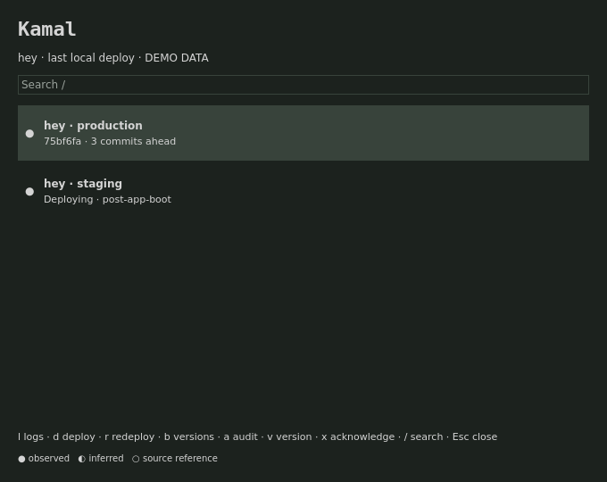

# Kamal

<p>
<a href="https://github.com/tcballard/omarchy-plugin-kamal/actions/workflows/test.yml"></a>
<a href="LICENSE"></a>
<a href="https://github.com/tcballard/omarchy-badges"></a>
</p>

**Your deployments, in view.**

A native Omarchy bar plugin for developers deploying with Kamal. See deployment activity recorded by local hooks, the last deployed revision and commits ahead, then open logs or stage deploy and rollback commands for review in your terminal. Remote polling is opt-in.

On Omarchy Quattro, with the dependencies below installed:

```sh
omarchy plugin add https://github.com/tcballard/omarchy-plugin-kamal.git
```

Then [enable the plugin and add its bar widget](#use).

**Development preview · 0.1.0-preview.1.** Portable tests and QML fixture checks pass; live Omarchy acceptance is still outstanding. [Verification](VERIFICATION.md) · [Current limits](docs/STATUS.md) · [View the fixture preview](preview.png).

<details>
<summary>Files, processes and network access</summary>

Reads local Git repositories, Kamal hook events and deployment metadata; checks .kamal/secrets existence only; writes ~/.local/state/kamal; explicit hook setup also writes ~/.config/kamal/hook-tap and appends to project .kamal/hooks with backups; executes local CLI collectors and explicit actions; no network during default collection; optional SSH polling and user-approved Kamal terminal commands contact configured deploy hosts; no root.

</details>

Dependencies (review and install yourself):

```sh
pacman -S nodejs jq git bash ruby libnotify
```

Optional: Kamal/Bundler, SSH and a supported terminal for deployment actions. Alacritty, Ghostty and Kitty are supported; TERMINAL must be an executable name/path without embedded arguments. No packages, hooks or shell configuration are installed by the plugin loader.



## Use

The horizontal bar shows only **Kamal** and a Nerd Font status glyph: cube for no
local deployment history, rocket for a local run in progress, Git branch for
commits ahead, check-circle for a recorded local deployment, question-circle for
unavailable or incomplete, warning triangle for errors, and spinner for loading.
Glyphs inherit Omarchy's configured bar font and theme colours, matching its
built-in icon convention; a Nerd Font with Font Awesome glyph coverage is required.
Indicators consider all discovered projects; `✓` does not certify remote health.
Vertical bars show only the indicator. Hover for a summary; click for the project
details and existing keyboard controls in the popover.

Add this standalone Git repository with `omarchy plugin add https://github.com/tcballard/omarchy-plugin-kamal.git`, review it, then enable `io.github.tcballard.kamal` and place its widget in the bar. Development preview source is available in this repository; no tagged release or marketplace approval is claimed.

The panel is native QML in Quattro. Click to open; j/k or arrows select; / searches; Escape closes. l logs; d deploy; r redeploy; b show versions then 1–5 stage rollback; a audit; v deployed version; L lock status; K stage lock acquisition with an editable message; i metadata/poll details; x acknowledge failure; p select active project; h stage hook setup. Commands that change files, deployments, plugins or processes are staged in a terminal: Enter is the review/execute boundary.

Config is optional: `~/.config/kamal/config.json` (XDG overrides respected). Copy `config.example.json` only if you need to change defaults. State is `~/.local/state/kamal/`. Updates do not replace either directory.

`omarchy-shell io.github.tcballard.kamal refresh` requests a refresh; `status` returns a bounded status summary. The built-in trusted bar can resolve the service. A third-party replacement bar may not have service access; the widget reports unavailable.

## Behavior and limits

Deploy actions use the foreground wrapper so a real failed exit can be recorded. Remote polling is off by default and rate-limited to ten minutes, including failures. Audit/lock/version text is not parsed into confident facts. Existing hook files with non-shell shebangs require manual integration; custom hooks_path and early exit statements also require manual placement. Hook setup is staged, never performed on installation. The hook tap must remain installed at its printed path. Hook journals rotate at 2 MiB.

Complements deployment CLIs and log viewers; does not run a deploy daemon.

## Verify

`./tests/run` runs model tests and portable manifest validation. On Omarchy also run `omarchy plugin validate .` and test actual enable/disable, IPC, orientation, monitor and terminal behavior. The screenshot uses real Panel.qml with host stubs and fictional data; it is not a live desktop screenshot.

## Remove

Disable/remove through Omarchy. Collection stops with the hosted service. User configuration and state remain intentionally. Remove optional external hook snippets manually before deleting their targets.

Apache-2.0. Contributions require DCO sign-off (`git commit -s`).

## Update and remove

Install with `omarchy plugin add https://github.com/tcballard/omarchy-plugin-kamal.git`. Then:

```sh
omarchy plugin enable io.github.tcballard.kamal
omarchy plugin update io.github.tcballard.kamal
omarchy plugin disable io.github.tcballard.kamal
omarchy plugin remove io.github.tcballard.kamal
```

## Compatibility

Targets the Quattro hosted service/bar-widget API. No live Omarchy version or supported version range is certified by this preparation. Node 22+ is required. See [verification](VERIFICATION.md) and [remaining scope](docs/STATUS.md).
